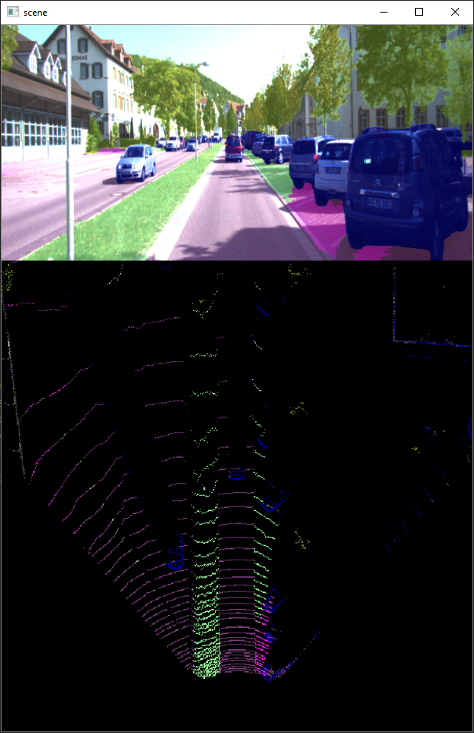
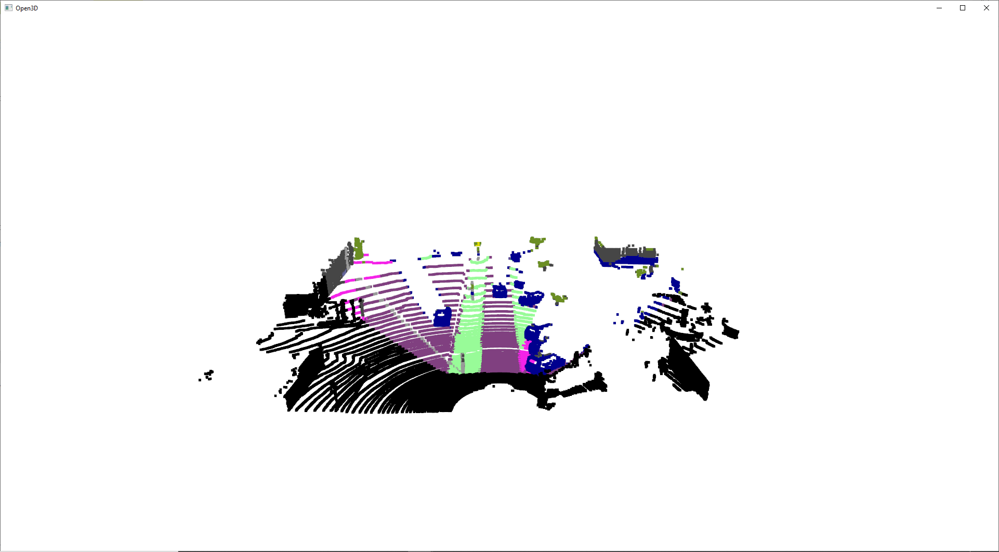

# PointPainting (Point Cloud Semantic Segmentation)

Pytorch implementation of [PointPainting](https://arxiv.org/pdf/1911.10150.pdf) for realtime pointcloud semantic segmentation painting based on [BiSeNetv2](https://arxiv.org/pdf/1808.00897.pdf) 


#### Contents

- BiSeNetv2 model trained on KITTI dataset 
- Implementation of the pointpainting fusion algorithm

### Demo Video


### Run Demo
```python
# Run demo on the default arguments set to one of kitti samples
python demo.py

# Run on custom samples
python demo.py --image_path PATH_TO_IMAGE --pointcloud_path PATH_TO_POINTCLOUD --calib_path PATH_TO_CALIB --weights_path PATH_TO_MODEL_WEIGHTS
```


```python
# add --mode 3d to see a 3d visualization of painted pointcloud
python demo.py --mode 3d
```



### Run Demo on Videos
```python
# PATH_TO_VIDEO is path contains 'image_02' & 'velodyne_points' together
# PATH_TO_CALIB is path contains calib files ['calib_cam_to_cam', '', '']
# --mode 3d to visualize 3d painted pointcloud or 2d to visualize image + bev
python demo_video.py --video_path PATH_TO_VIDEO --calib_path PATH_TO_CALIB --mode 3d

# You can download from http://www.cvlibs.net/datasets/kitti/raw_data.php
```


## BiSeNetv2
Real-time semantic segmentation


The implementation from https://github.com/CoinCheung/BiSeNet is trained on CityScapes datasets.
I finetuned it on KITTI dataset.

### Training on KITTI dataset
```python
cd BiSeNetv2
python train.py 
```
### Test on KITTI Semantic
```python
cd BiSeNetv2
python test.py
```

### KITTI Dataset
Semantic KITTI dataset contains 200 images for training & 200 for testing <br>
Download it from [KITTI website](http://www.cvlibs.net/datasets/kitti/eval_semseg.php?benchmark=semantics2015)

```python
# visualize dataset on tensorboard
python visualization.py --tensorboard

# PATH_TO_TENSORBOARD_FOLDER is "BiSeNetv2/checkpoints/tensorboard"
tensorboard --logdir PATH_TO_TENSORBOARD_FOLDER
```
